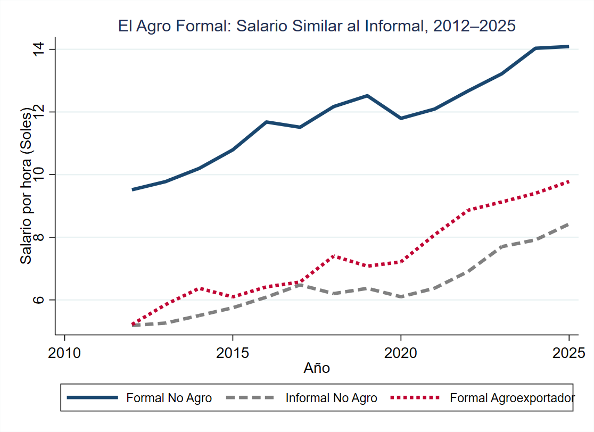
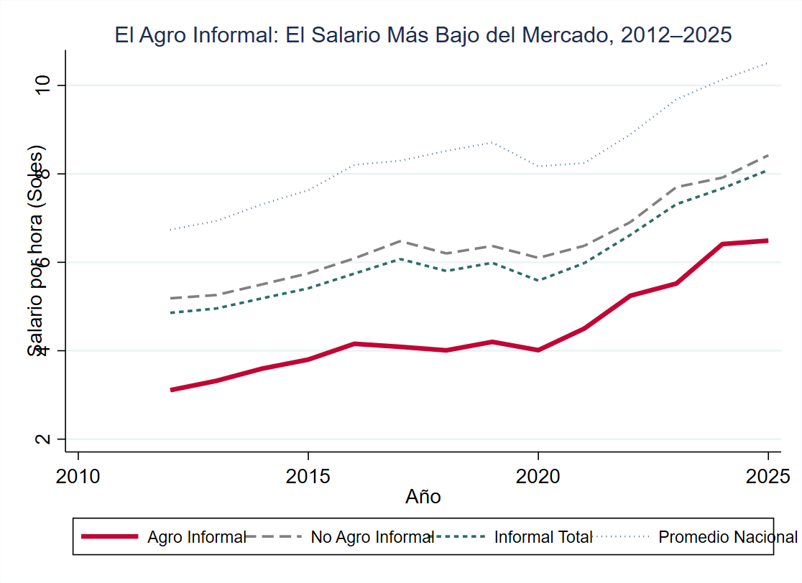

# Wages in Peru's Agroexporter Sector

This repository contains the code, data-processing procedures, methodology, and charts used to analyze wage outcomes among workers in Peru's agricultural and agroexporter sector.

The analysis uses Peru's **Encuesta Nacional de Hogares (ENAHO)** for 2012–2025 and identifies workers whose employment falls within the activities covered by Peru's agricultural labor legislation.


> Raw ENAHO microdata are not included in this repository. The code assumes that the corresponding annual ENAHO files are available locally.

---

## Data

**Source:** Instituto Nacional de Estadística e Informática (INEI), Encuesta Nacional de Hogares (ENAHO).

**Period:** 2012–2025.

The analysis uses the ENAHO employment, income, occupation, economic activity, insurance, and geographic variables needed to construct:

* hourly labor income;
* employment status;
* labor informality;
* agricultural/agroindustrial employment;
* the agroexporter-sector worker indicator.

Survey weights (`fac500a`) are used for the descriptive wage statistics.

---

# Identification of agroexporter-sector workers

## Legal framework

The identification follows the scope of **Ley N.º 31110, Ley del régimen laboral agrario y de incentivos para el sector agrario y riego, agroexportador y agroindustrial**.

The law establishes the labor regime applicable to workers engaged in agricultural, agroindustrial, and related activities covered by the legislation. The empirical strategy translates these legal criteria into observable characteristics in ENAHO.

Because ENAHO does **not** directly identify whether an employer is legally registered as an agroexporting firm, the resulting variable should be interpreted as an **ENAHO-based approximation of workers covered by the activities defined by the law**, rather than a direct observation of legal beneficiary status.

## Operationalization

The identification is constructed using the worker's **economic activity (`p506`)**, **ISIC Rev.4 activity (`p506r4`)**, and **geographic location (`ubigeo`)**.

| Legal criterion                         | ENAHO variable        | Operationalization                                                                          | Main assumption                                                                                |
| --------------------------------------- | --------------------- | ------------------------------------------------------------------------------------------- | ---------------------------------------------------------------------------------------------- |
| Agricultural activities                 | `p506` — ISIC Rev.3   | Activities in the **01xx** range are classified as agricultural beneficiaries               | The worker's reported economic activity accurately identifies agricultural employment          |
| Agroindustrial activities               | `p506` — ISIC Rev.3   | Activities in the **15xx** range are considered agroindustrial                              | The worker's reported ISIC activity adequately identifies agroindustrial employment            |
| Geographic restriction for agroindustry | `ubigeo`              | Agroindustrial workers in **Lima Province (`1501`) and Callao (`0701`)** are excluded       | Geographic location can be used to reproduce the geographic restriction in the legal framework |
| Excluded agroindustrial activities      | `p506r4` — ISIC Rev.4 | ISIC Rev.4 activities **1061, 1200, 1040, and 1103** are excluded                           | The Rev.4 classification provides an appropriate mapping of activities excluded by the law     |
| Salaried employment                     | `p507`                | Wage analysis is restricted to workers classified as employees/paid workers (`3`, `4`, `6`) | The relevant population for the wage analysis consists of salaried workers                     |

### Classification rule

The final `agroindustria` indicator is constructed as follows:

1. **Agricultural workers:** classified as beneficiaries when their ISIC Rev.3 activity is in the 01xx range.
2. **Agroindustrial workers:** classified as beneficiaries when their ISIC Rev.3 activity is in the 15xx range, **outside Lima Province and Callao**, and their ISIC Rev.4 activity is not among the excluded categories.
3. **All other workers:** classified as non-agroindustrial.

In simplified form:

```text
Agroindustrial-sector worker =

    Agricultural activity (ISIC Rev.3 01xx)

    OR

    Agroindustrial activity (ISIC Rev.3 15xx)
    AND outside Lima/Callao
    AND not an excluded ISIC Rev.4 activity
```

This classification is applied at the worker level using the economic activity reported for the worker's principal employment.

---

## Informality

Informality is defined consistently with the **INEI/OIT approach** for salaried workers, based on access to health insurance provided through the employer.

The analysis uses:

* `p4191–p4198`: whether the worker has each type of health insurance.
* `p419a1–p419a8`: whether the employer pays for that insurance.
* `p507`: identifies salaried workers; only categories 3, 4, and 6 are included in the wage analysis.

`p510a1`, which measures the formal/informal status of employers and self-employed workers, is **not used**, since these groups are outside the salaried-worker sample.

The classification proceeds in three steps:

1. **Default all workers to informal.**
2. **Classify a worker as formal** if at least one health-insurance type is both reported (`p419j == 1`) and employer-paid (`p419aj == 1`).
3. **Set the classification to missing** when the relevant insurance information is missing, rather than assuming that a missing response indicates informality.

Thus, among salaried workers, informality is identified through the **absence of employer-provided health insurance**, while missing insurance information is treated as unknown rather than informal.

---

# Wage measure

Hourly labor income (`ingtot`) is constructed from the relevant ENAHO labor-income components.

Total labor income is calculated as:

```text
Total labor income =
i524a1 + d529t + i538a + i530a + d536 + i541a + d543
```

Hours worked are constructed as:

```text
Hours worked = i513t + i518
```

For workers whose reported frequency corresponds to the relevant alternative time unit, `i520` is used instead.

Hourly income is then calculated as:

```text
Hourly income = Total labor income / Hours worked / 52
```

The resulting measure is interpreted as **hourly labor income in soles**.

---


# Main comparisons

The analysis compares hourly wages across four groups:

1. **Formal, non-agroindustrial workers**
2. **Informal, non-agroindustrial workers**
3. **Formal agroindustrial/agroexporter workers**
4. **Informal agroindustrial/agroexporter workers**

The figures use ENAHO survey weights (`fac500a`) and report mean hourly labor income by year.

The main objective is to assess whether the formal agroexporter sector exhibits different wage outcomes from other formal and informal workers in Peru.

## Main findings

### 1. Formal agroexporter wages vs. the rest of the economy



According to ENAHO, **formal wages in the agroexporter sector are systematically close to informal wages in the rest of the economy**, showing that formal employment in this sector has not translated into earnings comparable to those of formal employment elsewhere.

The gap between formal non-agro wages and formal agroexporter wages is large and persistent. **The agro sector consistently aligns with the lower end of the labor market, despite its formal employment status.**

This suggests that the sector's low wages are not simply an inherent characteristic of agricultural work. **For years, the legal framework allowed the sector to operate with lower labor costs than those prevailing under the general labor regime.**

### 2. Informal agroexporter wages



**Informal agro employment has been the lowest-paid segment of the salaried labor market for more than a decade.** Even during the agroexport boom, informal workers in the sector remained well below the national average.

The persistence of this gap highlights the particularly vulnerable position of informal workers in the agricultural labor market.

